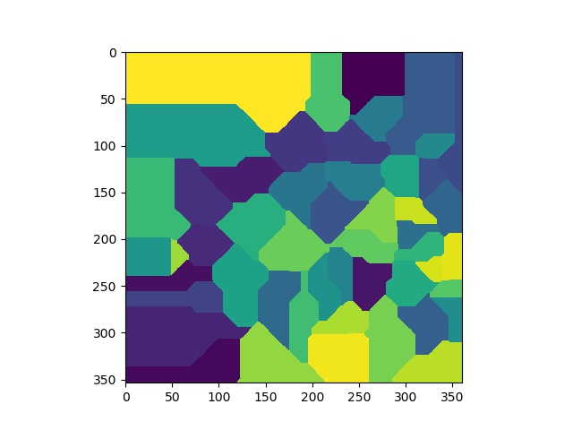

## Link
https://adventofcode.com/2018/day/6

## Voronoi Diagram
Here, I talk about [voronoi diagrams](https://en.wikipedia.org/wiki/Voronoi_diagram).  
Voronoi diagram is an interesting partitioning scheme where we divide a plane into various regions that is created by 
taking distance to **fixed points** lying in the same plane. Using the resulting regions, we can find to which point (out of fixed points) 
an arbitarily chosen point is nearest to.  
In terms of *field*, think of it as region where the fixed points have influence on to any other point on the plane.  

### Approach for Constructing Voronoi Diagram

**plane generation**  
Say we have a **n** 2d points, named **coords** as:
```python
[(x1, y1), (x2, y2), ... (xn, yn)]
```
Now, I construct a plane that consists of integer locations (where 2d points reside). I simulate this by actually creating 
a list of points starting from **(0, 0), (0, 1), .... (1, 0), (1, 1), (1, 2),..** to (a, b).  
This is done by creating cross product between two lists of Xs and Ys.  
  
Say, we have:
`xx = [0, 1, 2, 3]` and `yy = [0, 1]`.
So, we generate every possible points on the plane using cross-product between xx and yy. The resulting matrix is:  
[  
    0 0  
    0 1  
    1 0  
    2 0  
    2 1  
    3 0  
    3 1  
]
  
So, I generate every possible points on the plane of size (width, height) which should generate **width X height** number of points on 
the plane. 
  
Remember, this plane covers our initial n **fixed points** mentioned at the start.  
Following code generates the points on the plane:
```python
coord_matrix = np.array(coords)
X, Y = zip(*coords)
w, h = width, height
xx = list(range(w))
yy = list(range(h))
mat = np.array(list(itertools.product(xx, yy)))
```

Here, `coord_matrix` is a matrix of size **nX2** and `mat` is the matrix of size **(width, height)**.  
`itertools` module is used to find the [cross product](https://en.wikipedia.org/wiki/Cross_product). 

**Distance Matrix**  
Now, we compute the distance of every point on the plane to the **n** fixed points on the plane. 
That is: for every point in **mat**, we find distance to all the points in `coord_matrix`.  
The distance can be any metric like:  
- [euclidean](https://en.wikipedia.org/wiki/Euclidean_distance)
- [manhattan](https://en.wikipedia.org/wiki/Taxicab_geometry)
- [cosine similarity](https://en.wikipedia.org/wiki/Cosine_similarity)

For simplicity, here I use manhattan.  
```python
distances = manhattan_distances(mat, coord_matrix)
```
Here, `distances` matrix is of size **( widthXheight, n)**  
We make use of `sklearn` for computing the distances:

```python
from sklearn.metrics.pairwise import manhattan_distances
```


**computing nearest point**  
Using `distances` matrix, we just find the **fixed point** that is nearest. So, for each row in `distances` we use arg min to 
find the index to the nearest fixed point.  
```python
dist_min_idx = np.argmin(distances, axis=1)
```

**creating regions**  
This is the main part where we create regions in the plane by making use of `dist_min_idx`.  
So, I create a 2d array that represent the whole plane and consists of all the points in **mat**.  
```python
arr = np.zeros((w, h))
```

Then, I loop through each row in **mat**. This is basically iterating over every point in the plane. 
```python
for i, p in enumerate(mat):
    r, c = p
    idx = dist_min_idx[i]
    dist = distances[i]
    mn = np.min(dist)
    arr[r, c] = dist_min_idx[i]
```
Here, we are accessing every location in the plane and then for each location we are simply assigning the index of nearest fixed point.  

Finally, we plot the 2d array using matplotlib:
```python
plt.imshow(arr)
plt.show()
```
This gives us voronoi diagram like this:  

